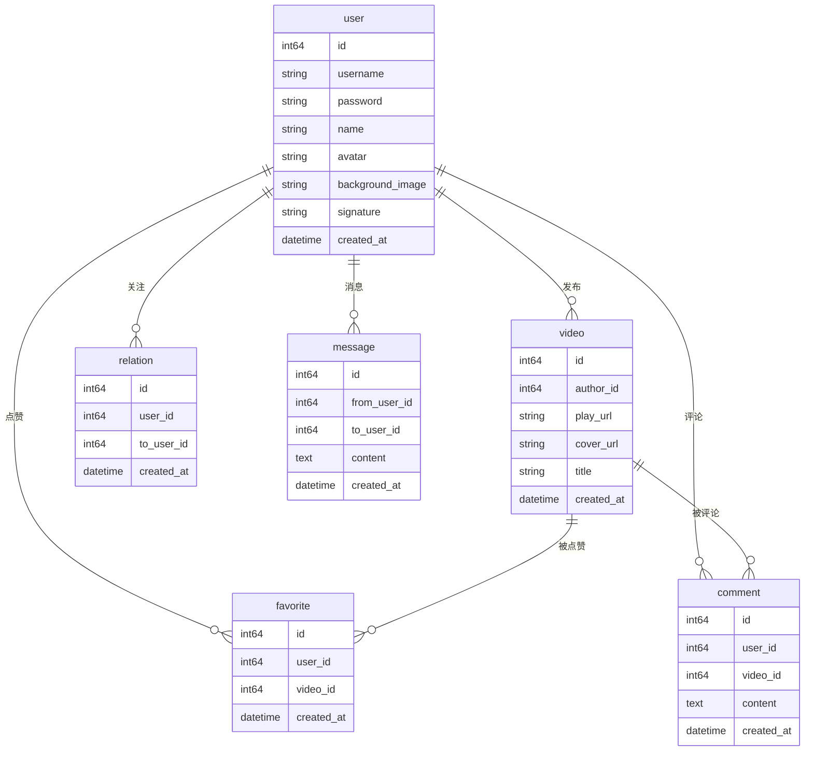

# mini_douyin

极简版抖音后端项目，基于 Go + Gin + GORM + MySQL + Redis 实现，支持基础视频流、用户、点赞、评论、关注、消息等功能，具备接口鉴权、限流、自动化测试与覆盖率统计、Swagger 文档等工程能力。

## 功能特性
- 视频 Feed 流、视频投稿、个人主页
- 用户注册、登录、鉴权（JWT）
- 点赞/取消点赞、喜欢列表
- 评论/删除评论、评论列表
- 关注/取关、关注/粉丝列表
- 消息发送、聊天记录
- Redis 缓存计数，接口限流防刷
- 自动化测试、覆盖率统计、CI/CD
- Swagger 自动生成接口文档

## 快速启动

### 1. 环境准备
- Go 1.20+
- MySQL 8+
- Redis 5+

### 2. 配置数据库和 Redis
1. 创建数据库：
   ```sql
   CREATE DATABASE IF NOT EXISTS mini_douyin DEFAULT CHARSET utf8mb4;
   ```
2. 修改 `config/config.yaml`，填入你的 MySQL/Redis 连接信息。

### 3. 安装依赖
```sh
go mod tidy
```

### 4. 启动服务
```sh
go run main.go
```
服务默认监听 `:8080`。

### 5. 运行测试与覆盖率
```sh
go test ./... -coverprofile=coverage.out
```

### 6. 生成并查看接口文档
```sh
go install github.com/swaggo/swag/cmd/swag@latest
swag init
```
访问 [http://localhost:8080/swagger/index.html](http://localhost:8080/swagger/index.html)

### 7. Docker 一键部署

#### 1. 创建 `docker-compose.yml`
```yaml
version: '3.8'
services:
  mysql:
    image: mysql:8
    environment:
      MYSQL_ROOT_PASSWORD: 123456
      MYSQL_DATABASE: mini_douyin
    ports:
      - "3306:3306"
    command: --default-authentication-plugin=mysql_native_password
    restart: always
  redis:
    image: redis:6
    ports:
      - "6379:6379"
    restart: always
  app:
    build: .
    ports:
      - "8080:8080"
    depends_on:
      - mysql
      - redis
    environment:
      - GIN_MODE=release
    restart: always
```

#### 2. 创建 `Dockerfile`
```dockerfile
FROM golang:1.20-alpine as builder
WORKDIR /app
COPY . .
RUN go mod tidy && go build -o mini_douyin main.go

FROM alpine:latest
WORKDIR /root/
COPY --from=builder /app/mini_douyin .
COPY config ./config
EXPOSE 8080
CMD ["./mini_douyin"]
```

#### 3. 一键启动
```sh
docker-compose up --build
```

## 目录结构
```
mini_douyin/
├── cmd/                # 启动入口
├── config/             # 配置文件
├── controller/         # Gin handler（参数校验、响应、Swagger注释）
├── service/            # 业务逻辑
├── dao/                # 数据库操作
├── cache/              # Redis操作
├── middleware/         # 鉴权、限流等
├── model/              # 数据库模型
├── static/             # 静态资源
├── .github/workflows/  # CI配置
├── main.go             # 启动入口
└── README.md           # 项目说明
```

## 数据库设计ER图



## 接口示例

### 用户注册
```http
POST /douyin/user/register/?username=test&password=123456
```
返回：
```json
{
  "status_code": 0,
  "user_id": 1,
  "token": "..."
}
```

### 视频Feed流
```http
GET /douyin/feed/
```
返回：
```json
{
  "status_code": 0,
  "video_list": [ ... ],
  "next_time": 1680000000
}
```

### 点赞
```http
POST /douyin/favorite/action/?token=xxx&video_id=1&action_type=1
```
返回：
```json
{
  "status_code": 0
}
```

### 评论
```http
POST /douyin/comment/action/?token=xxx&video_id=1&action_type=1&comment_text=hello
```
返回：
```json
{
  "status_code": 0,
  "comment": { ... }
}
```

更多接口详见 Swagger 文档或 `controller/` 目录。

## 安全与工程能力
- JWT 鉴权，接口分组
- Gin 限流中间件，防刷
- GORM 防SQL注入
- 自动化测试与覆盖率统计
- CI/CD（GitHub Actions + Codecov）

## 贡献与交流
欢迎提 issue、PR 或交流建议！

---

> 本项目为极简版抖音后端实践，适合 Go/Gin/MySQL/Redis 工程学习与二次开发。 